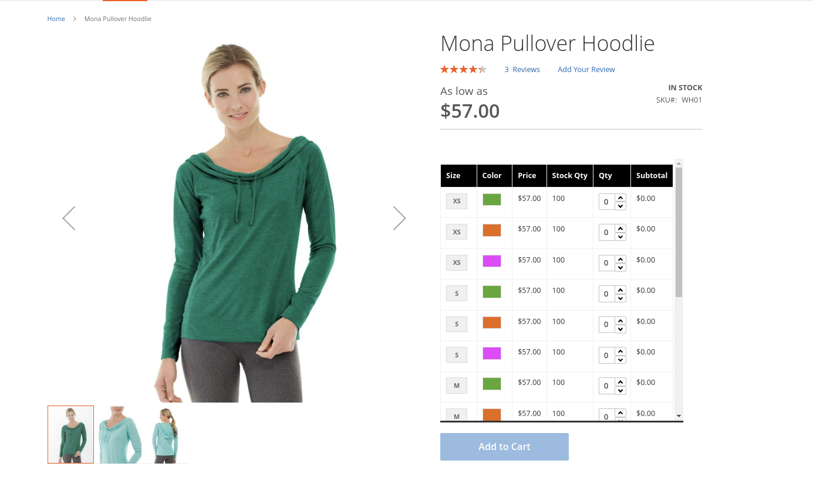
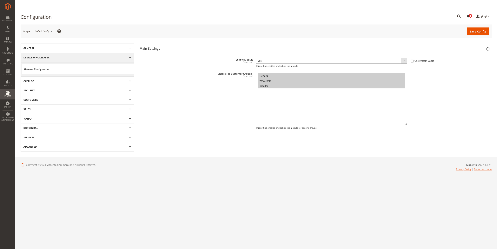

---
#   Devall_Wholesale


The Devall_Wholesale extension serves as a valuable tool, showcasing all simple products in a table grid view. This unique table not only enhances the clarity and comprehensiveness of product displays but also facilitates customers in swiftly and conveniently selecting their desired items, thereby offering support to online stores.

---





---

## Installation

1. Install the module via Composer by running the following command in the Magento 2 root directory:

   ```
   composer require developersalliance/module-wholesale
   ```

2. Run the Magento upgrade command to install the module:

   ```
   bin/magento setup:upgrade
   ```

## Features
- Transforms configurable product presentation from dropdown lists to a grid layout.
- Displays all variation combinations as individual products for easy selection.
- Detailed yet organized presentation of each variation on the product page.
- Significantly reduces the number of clicks needed to select a product variation.
- Simplifies the shopping experience by allowing quick addition of products to the cart.


## License

This module is licensed under the [MIT License](LICENSE).   
---
